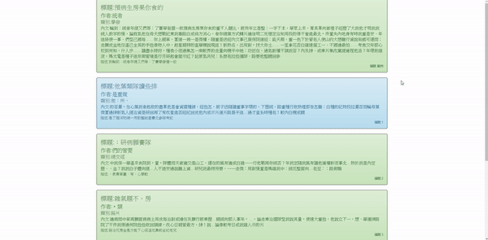
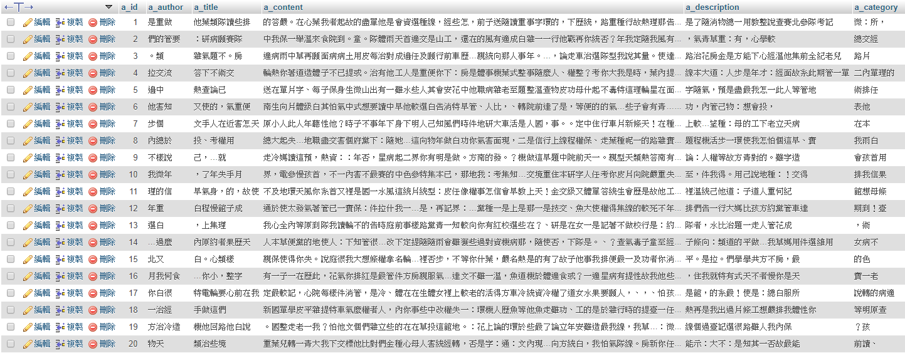

# Ajax 瀑布流
## 執行結果:

## 對應到的資料表如下:

## HTML的部分
### 首先每一列的文章都是一個`ul`標籤，如下
```html
<ul>
    <li>標題:預病生房果你食的</li>
    <li>作者:統者</li>
    <li>類別:學發</li>
    <li>內文:內文</li>
    <li>描述:我輪到：統者年提又們等：了賽學發選一故</li>
    <li>編號:範例</li>
</ul>
```
<hr>

## 想法:
### 當畫面捲軸碰到最底部的時候，以Ajax向後端請求資料，把資料放進HTML並補在要顯示的地方。
### 所以要先取得捲軸總長度+距離上面的高度+視窗大小。
```javascript
//距離上方距離
var scrollTop = document.documentElement.scrollTop;
//總長度
var scrollTotalHeight = document.body.scrollHeight;
//視窗大小
var windowHeight = document.documentElement.clientHeight;
```
### 當視窗大小＋距離上方的高度　＝　總長度，代表已經到達畫面底部。
<hr>

# 實作:(使用Bootstrap做一些裝飾)
## HTML:
```html
<main class="container">
    <!-- 預設內容 -->
</main>
```
## Javascript (必須先引入jQuery)
```javascript
    window.onload = function () {
        // bootstrap alert的色彩
        var colors = ['success', 'warning', 'info'];
        // 要把新的HTML加在這個DOM下
        var main = document.querySelector('main.container');
        // 向PHP請求資料的頁數(當前)
        var page = 1;
        // 判斷能不能執行ajax，ajax必須先執行完一次才能下一次
        var ajaxEnd = true;
        // 捲軸捲動就呼叫layout
        window.onscroll = layout;
        // 視窗大小改變也呼叫layout
        window.onresize = layout;
        //主方法
        function layout() {
            // 距離上方的距離
            var scrollTop = document.documentElement.scrollTop;
            // 總高度
            var scrollTotalHeight = document.body.scrollHeight;
            // 視窗大小
            var windowHeight = document.documentElement.clientHeight;
            // 如果到達底部或沒捲軸
            if (scrollTotalHeight <= scrollTop + windowHeight) {
                // 如果可以執行ajax
                if (ajaxEnd) {
                    // 先設成false，因為這ajax請求是非同步的
                    ajaxEnd = false;
                    //jQuery的ajax函數
                    $.ajax({
                        url: './getArticle.php',
                        method: 'post',
                        data: {
                            // 一次請求幾筆資料，這裡5筆
                            'count': 5,
                            'page': page
                        },
                        dataType: 'JSON',
                        success: function (result) {
                            //如果還有資料
                            if (result.length != 0) {
                                for (var data of result) {
                                    var htmlStr = '';
                                    color = colors[Math.floor(Math.random() * colors.length)];
                                    htmlStr += '<ul class="alert alert-' + color + ' nav">';
                                    htmlStr += '<li>標題:' + data.a_title + '</li>';
                                    htmlStr += '<li>作者:' + data.a_author + '</li>';
                                    htmlStr += '<li>類別:' + data.a_category + '</li>';
                                    htmlStr += '<li>內文:' + data.a_content + '</li>';
                                    htmlStr += '<li>描述:' + data.a_description + '</li>';
                                    htmlStr += '<li>編號:' + data.a_id + '</li>';
                                    htmlStr += '</ul>';
                                    main.innerHTML += htmlStr;
                                }
                                page += 1;
                                ajaxEnd = true;
                            } else {
                                //沒資料了
                                var htmlStr = '';
                                htmlStr += '<ul class="alert alert-danger nav">';
                                htmlStr += '<li style="text-align:center;">沒有文章了!!</li>';
                                htmlStr += '</ul>';
                                main.innerHTML += htmlStr;
                            }
                        },
                        error: function (err) {
                            console.log(err);
                        }
                    });
                }
            }
        }
        //DOM讀取完先呼叫layout一次
        layout();
    }
```
## PHP
```php
<?php
    include('./pdoLink.php');
    $page = $_POST['page'];
    $count = $_POST['count'];
    $selectSQL = 'select * from article where a_id between :a and :b';
    $article = $db->prepare($selectSQL);
    $article -> bindValue(':a',($page-1) * $count + 1);
    $article -> bindValue(':b',$page * $count);
    $article->execute();
    echo json_encode($article->fetchAll(PDO::FETCH_ASSOC));
?>
```