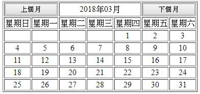
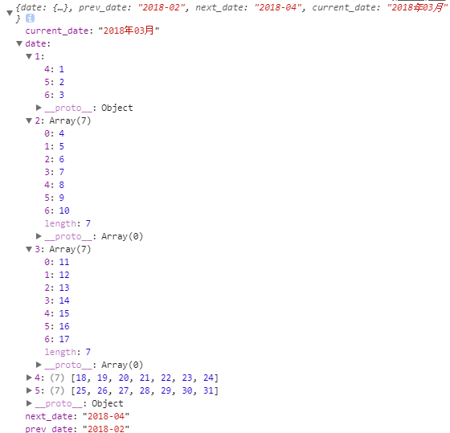

# Ajax萬年曆
## 執行結果：


---
### 有些時候需要一個萬年的月曆、週曆或是一些特殊的格式或功能，沒有現成的套件或函數可以直接用的時候，就只能自己寫一個。
### 這個範例還沒加入點擊事件，可以自己加入。

# 程式碼:
## HTML
```html
<table border="1">
    <tr>
        <td colspan="2">
            <button id="prev">上個月</button>
        </td>
        <td id="currentDate" colspan="3"></td>
        <td colspan="2">
            <button id="next">下個月</button>
        </td>
    </tr>
    <tr>
        <td>星期日</td>
        <td>星期一</td>
        <td>星期二</td>
        <td>星期三</td>
        <td>星期四</td>
        <td>星期五</td>
        <td>星期六</td>
    </tr>
    <tbody id="dayBody">

    </tbody>
</table>
```

## JavaScript(有使用jQuery，需先引入jQuery)
```javascript
$(function () {
    function renderDate(date) {
        $.ajax({
            //請求的網址
            url: 'date.php',
            //回傳資料格式
            dataType: 'json',
            //方法為POST
            method: 'POST',
            //傳值
            data: {
                date: date
            },
            //完成的時候
            success: function (result) {
                //先把表格中日期的部分清空
                $("#dayBody").html('');
                //取得result[date]中所有的key，並以forEach迭代
                Object.keys(result['date']).forEach(function (x) {
                    //加入tr到最後
                    $("#dayBody").append("<tr></tr>");
                    //一週有7天，所以7個td，插在最後一個tr
                    for (var i = 1; i <= 7; i++) {
                        $("#dayBody tr").last().append("<td></td>");
                    }
                    Object.keys(result['date'][x]).forEach(function (y) {
                        //選取 最後一個tr中尋找td的第y(星期幾)個，文字放入日期。
                        $("#dayBody tr").last().find('td').eq(y).text(result['date'][x][y]);
                    });
                    //設定上下月按鈕及當前月份文字
                    $("#prev").attr('date', result['prev_date']);
                    $("#next").attr('date', result['next_date']);
                    $("#currentDate").text(result['current_date']);
                });
            },
            //錯誤的時候
            error: function (err) {
                console.log(err)
            }
        });
    }
    //一開始先渲染一次
    renderDate(null);
    //當按鈕被點下
    $("button").click(function () {
        //把日期傳進去
        renderDate($(this).attr('date'));
    })
});
```

## 回傳json格式如下



### 所以`Object.keys(result['date'])`會取得的結果為[1,2,3,4,5]，依此類推

## PHP的部分
```php
<?php
    //三元運算子，如果POST的date是空的，就預設當前年-月，否則就是傳過來的date
    $date = ($_POST['date']=="")?date('Y-m'):$_POST['date'];
    //$y,$m分別為以'-'切割date後的[0]與[1]
    list($y,$m) = explode('-',$date);
    //取得某月最大天數
    $max_day = date("t",strtotime($y.'-'.$m."-1"));
    //週的陣列
    $week = mb_split(' ','日 一 二 三 四 五 六');
    //一開始為第一週
    $count = 1;
    $result['date'] = [];
    for($i=1;$i<=$max_day;$i++){
        //取得星期n
        $index = date('w',mktime(0,0,0,$m,$i,$y));
        //如果為禮拜日(0)而且目前result的date是有日期的，就換到下一週
        if($index==0 && count($result['date']) != 0){
            $count++;
        }
        //result的date的週數的星期幾 = 日期
        $result['date'][$count][$index] = $i;
    }
    //設定上下個月與當前年月
    $result['prev_date'] = date('Y-m',mktime(0,0,0,$m-1,1,$y));
    $result['next_date'] = date('Y-m',mktime(0,0,0,$m+1,1,$y));
    $result['current_date'] = date('Y年m月',mktime(0,0,0,$m,1,$y));
    //回傳json格式
    echo json_encode($result);
?>
```
