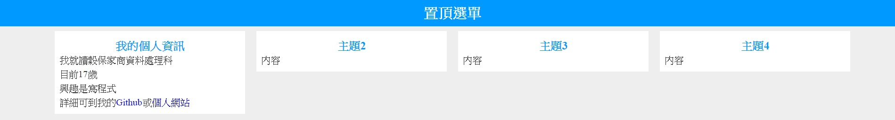
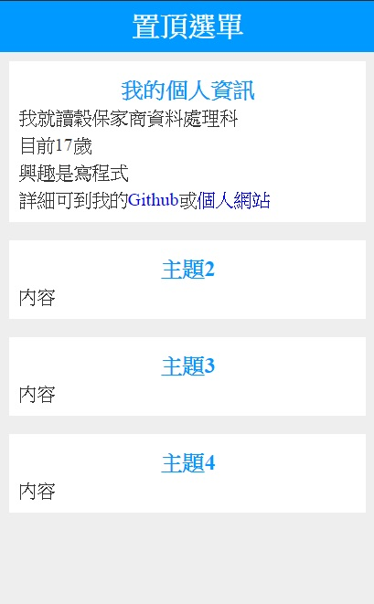

# CSS = > 排版

## 執行結果

## * 電腦畫面

## * 手機畫面


# CSS
```css
body {
            margin: 0; /*邊界:0*/
            text-align:center; /*文字對齊:置中*/
            background:#eee; /*背景:淺灰色*/
        }

        .top {
            background: #09f;
            color: #fff;    /*文字顏色白色*/
            font-weight: bolder;    /*文字寬度:粗*/
            font-size: 30px;    /*文字-大小:30px*/
            padding: 10px 0;    /*內部留白，上下留10，左右0*/
        }
        .box{
            width:20%;
            height:20%;
            display:inline-block;
            vertical-align: top;    /*垂直置中對齊*/
            margin:10px;
            background:#fff;
            text-align:justify; /*文字對齊:左右對齊*/
            font-size:20px;
            color: #333;
            line-height:30px;   /*行高:30px*/
            padding:10px;
            
        }
        /*螢幕最小寬度768px，最大寬度1280px時，執行*/
        @media screen and (min-width: 768px) and (max-width: 1280px){
            .box{
                width:45%;
            }
        }
        @media screen and (min-width: 400px) and (max-width: 840px){
            .box{
                width:90%;
            }
        }
        /*選取.box下一層的div*/
        .box>div{
            font-weight:bold;
            font-size:24px;
            color:#09f;
            text-align:center;
            padding-top:6px;
        }
        a{
            text-decoration:none;   /*底線:無*/
            color:#00f;
        }
```

# HTML

```html
    <div class="top">置頂選單</div>
    <div class="box">
        <div>
            主題1
        </div>
        內容1
    </div>
    <div class="box">
        <div>
            主題2
        </div>
        內容
    </div>
    <div class="box">
        <div>
            主題3
        </div>
        內容
    </div>
    <div class="box">
        <div>
            主題4
        </div>
        內容
    </div>
```