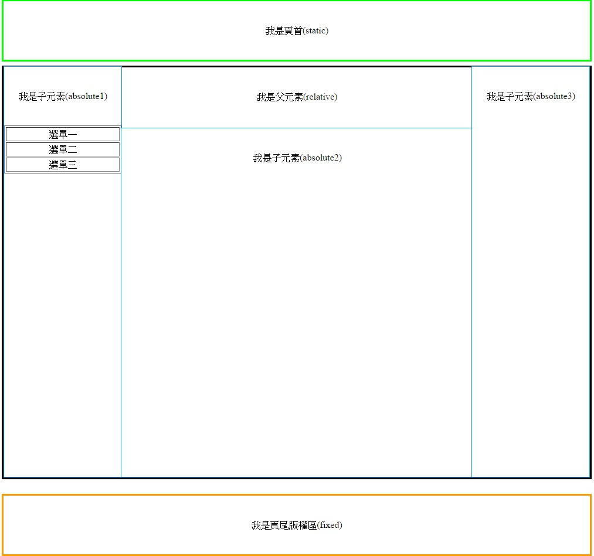

# CSS=>position

## 參考結果



## Position可以設的值有以下
* ## static => 靜態的
* ## relative => 父元素
* ## absolute => 子元素
* ## fixed => 固定的

# 簡介
## 在沒有任何設定之下 static(靜態的)與relative(父元素)是差不多的。
## absolute會定位在上層父元素(relative)的位置，可以透過top、bottom、left、right四個屬性做定位；如果上層沒有relative，則會從body定位。
## fixed固定定位，他會以瀏覽器的視窗來定位，即使頁面捲動，也還是留在畫面上，一樣使用top、bottom、left、right四個屬性做定位。

## CSS
```CSS
body{
    background:white;   /*背景顏色=白色*/
    margin:0px; /*邊界設為0*/
    margin-bottom:120px;    /*在頁面下方預留120px的位置*/
    width:1000px;
    margin-left:auto;   /*左邊界auto*/
    margin-right:auto;  /*右邊界auto*/
    /*左右邊界都設為auto，會自動對齊在中間*/
}
#footer{
    margin-left:auto;
    margin-right:auto;
    position:fixed; /*固定定位*/
    bottom:0px; /*與下方距離0px*/
    width:1000px;
    height:100px;
    background:white;
    border:solid #f90 3px;  /*邊框為實線，顏色#f90，粗細=3px*/
    line-height:100px;  /*行高100px*/
    text-align:center;  /*文字對齊置中*/
}
#static{
    position:static;    /*靜態的*/
    top:0px;    /*靠上0px*/
    left:0px;   /*靠左0px*/
    width:100%;
    height:100px;
    background:white;
    border:solid #0f0 3px;
    line-height:100px;
    text-align:center;
}
#relative{
    margin-top:7px; /*上方留7px*/
    position:relative;  /*父元素*/
    width:100%;
    height:700px;
    background:white;
    border:solid #000 3px;
    line-height:100px;
    text-align:center;
}
#absolute1{
    position:absolute;  /*子元素*/
    bottom:0;   /*離下方0px，但這邊以上層父元素的位置對齊*/
    width:200px;
    height:100%;
    background:white;
    border:solid #09f 0.5px;
    line-height:100px;
    text-align:center;
}
#absolute2{
    position:absolute;
    left:200px;
    bottom:0px;
    width:600px;
    height:85%;
    background:white;
    border:solid #09f 0.5px;
    line-height:100px;
    text-align:center;
}
#absolute3{
    position:absolute;
    right:0px;
    bottom:0px;
    width:200px;
    height:100%;
    background:white;
    border:solid #09f 0.5px;
    line-height:100px;
    text-align:center;
}
.menu{
    width:100%;
    line-height:20px;
}
```

## HTML

```HTML
<div id="static">
    我是頁首(static)
</div>
<div id="relative">
    我是父元素(relative)
    <div id="absolute1">
        我是子元素(absolute1)
        <table class="menu" border="1">
            <tr>
                <td>選單一</td>
            </tr>
            <tr>
                <td>選單二</td>
            </tr>
            <tr>
                <td>選單三</td>
            </tr>
        </table>
    </div>
    <div id="absolute2">
        我是子元素(absolute2)
    </div>
    <div id="absolute3">
        我是子元素(absolute3)
    </div>
</div>
<div id="footer">
    我是頁尾版權區(fixed)
</div>
```