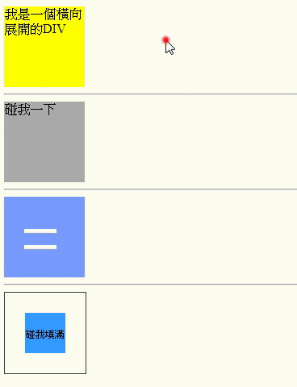

# Transition 範例-1
### 可能使用到了比較複雜一點點的CSS選擇器，如果對CSS選擇器比較不熟的人，建議先看一些CSS選擇器的教學。
## 執行結果


## HTML
```html
<div id="div1">我是一個橫向展開的DIV</div>
<hr>
<div id="div2">碰我一下
    <span></span>
</div>
<hr>
<div id="exit">
    <span></span>
    <span></span>
</div>
<hr>
<div id="zoom">
    <div>
        <p></p>
    </div>
</div>
```

## CSS
```css
        div {
            width: 100px;
            height: 100px;
        }

        #div1 {
            background: yellow;
            transition: width, 2s;
        }

        #div1:hover {
            width: 300px;
        }

        #div2 {
            background: #aaa;
            position: relative;
        }

        #div2>span {
            position: absolute;
            bottom: -20px;
            right: 0px;
            opacity: 0;
            transition: bottom, opacity, 1s;
        }

        #div2:hover>span {
            bottom: 0px;
            opacity: 1;
        }

        #div2>span::before {
            content: "碰到我了";
        }

        #exit {
            position: relative;
            background: #79f
        }

        #exit span {
            position: absolute;
            width: 40px;
            height: 5px;
            left: 25%;
            background: #fff;
            transition: all, 0.5s;
        }

        #exit>span:nth-child(2) {
            top: 40%;

        }

        #exit>span:nth-child(1) {
            top: 60%;
        }

        #exit:hover>span:nth-child(1) {
            transform: rotate(-45deg);
        }

        #exit:hover>span:nth-child(2) {
            transform: rotate(45deg);
        }

        #exit:hover span {
            top: 50%;
        }

        #zoom {
            position: relative;
            border: 1px #333 solid;
        }

        #zoom>div {
            width: 50px;
            height: 50px;
            position: absolute;
            top: 25%;
            left: 25%;
            background: #39f;
            transition: all, 1s;
        }

        #zoom>div:hover {
            top: 0;
            left: 0;
            width: 100px;
            height: 100px;
        }

        #zoom>div>p::before {
            font-size: 12px;
            text-align: center;
            width: 100%;
            height: 100%;
            position: absolute;
            top: 40%;
            content: "碰我填滿"
        }

        #zoom>div:hover>p::before {
            font-size: 16px;
            content: "填滿";
        }
```