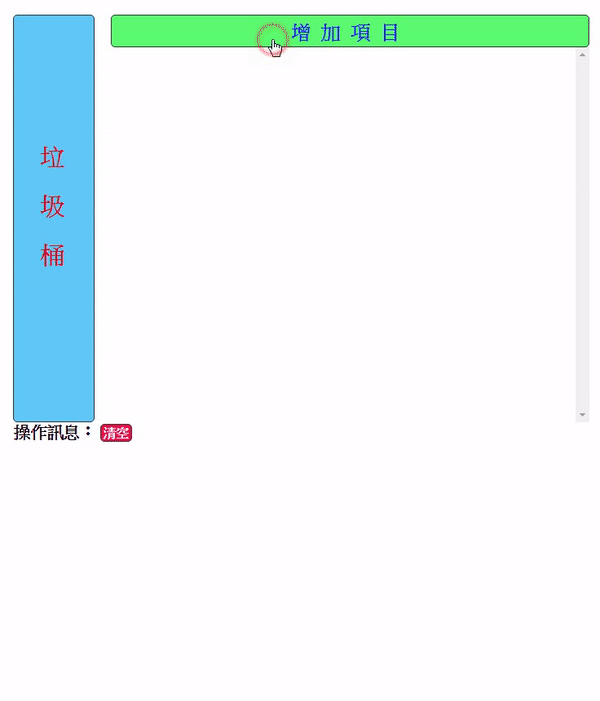

# HTML5拖放API

## 執行結果：[demoURL](https://laijunbin.github.io/WebExercise/skill09-draggableAPI/)


---

## 常用方法(這裡使用到的方法)
|事件|說明|
|---|---|
|dragstart|開始拖|
|dragenter|碰到可以拖的元素|
|dragleave|離開dragenter的元素|
|dragover|dragenter後拖的移動過程|
|drop|放(在可拖動的元素上)|

還有其他的方法如 `drag`,`dropend`在這裡沒有使用到。

---

## 首先是畫面的部分：

### HTML：
```html
<div id="container">
    <div id="trash">
        垃圾桶
    </div>
    <main>
        <button id="addDragObjBtn" data-value="1">增加項目</button>
        <div id="dragList">
        </div>
    </main>
</div>
<div id="messagebox">
    <p>操作訊息：
        <button id="clearMessageBtn">清空</button>
    </p>
</div>
```
### CSS
```CSS
* {
    margin: 0;
    padding: 0;
    box-sizing: border-box;
    user-select: none;
}

body {
    margin: 20px;
}

main {
    flex: 1;
    display: flex;
    flex-direction: column;
    margin: 0 20px;
    height: 500px;

}

#container {
    display: flex;
}

#trash {
    width: 100px;
    height: 500px;
    border: 1px solid #333;
    border-radius: 5px;
    writing-mode: vertical-lr;
    display: flex;
    align-items: center;
    justify-content: center;
    font-size: 30px;
    font-weight: 900;
    letter-spacing: 1em;
    background: rgb(96, 200, 248);
    color: rgb(212, 14, 31);
    transition: .5s;
}

#addDragObjBtn {
    border: 1px solid #333;
    border-radius: 5px;
    height: 40px;
    font-size: 24px;
    line-height: 40px;
    font-weight: 700;
    background: rgb(92, 251, 114);
    color: #211ce2;
    cursor: pointer;
    letter-spacing: .5em;
    transition: .5s;
}

#dragList {
    overflow-y: scroll;
    flex: 1;
}

#dragList>div {
    border: 1px #333 dotted;
    border-radius: 5px;
    height: 50px;
    margin-top: 10px;
    font-size: 30px;
    text-align: center;
    line-height: 50px;
    letter-spacing: .5em;
    transition: .3s;

}

#dragList>div:hover {
    background: rgba(51, 51, 51, .1);
    cursor: pointer;
}

#messagebox>p:first-child {
    font-size: 20px;
    font-weight: 700;
}


#messagebox>p:nth-child(n+2) {
    margin-left: 20px;
}

#dragLast {
    flex: 1;
    height: 10px;
}

#clearMessageBtn {
    border: 1px solid #333;
    border-radius: 5px;
    height: 16px;
    font-size: 16px;
    line-height: 16px;
    font-weight: 700;
    background: rgb(230, 18, 71);
    color: #fff;
    cursor: pointer;
    padding: 2px;
    box-sizing: unset;
}
```

## 重點在於JavaScript中
```javascript
//當畫面載入完成執行
window.onload = function () {
    //抓取DOM(頁面上的物件)
    var trash = document.getElementById('trash');
    var addBtn = document.getElementById('addDragObjBtn');
    var dragList = document.getElementById('dragList');
    var messageBox = document.getElementById('messagebox');
    var clearMessageBtn = document.getElementById('clearMessageBtn');

    //當點擊增加拖動物件的按鈕，呼叫增加拖動物件的方法
    addBtn.addEventListener('click', addDragList);

    //當清除訊息的按鈕被點下
    clearMessageBtn.addEventListener('click', function () {
        //如果訊息大於1個(第一個是操作訊息的提示文字)
        while (messageBox.children.length > 1) {
            //刪除第二個(陣列從0編號,0...1...2)
            messageBox.children[1].remove();
        }
    });

    //取消預設事件，不取消會觸發不到drop事件
    trash.addEventListener('dragover', function (e) {
        e.preventDefault();
        //或使用 return false; 有一樣的效果
    });

    //當放下
    trash.addEventListener('drop', function (e) {
        //取得上一個拖的物件的index
        let index = e.dataTransfer.getData('index');
        //取得上一個拖的物件
        let obj = document.querySelector(`#dragList>div[data-index="${index}"]`);

        //把上一個拖的物件大小縮放到0
        obj.style.transform = 'scale(0)';

        //有設定transition 0.3秒，所以0.3秒後刪除
        setTimeout(() => {
            obj.remove();
        }, 300);

        //變回原本的顏色
        this.style.background = "rgb(96, 200, 248)";
        this.style.color = 'rgb(212, 14, 31)';

        //新增操作訊息
        newMessage(`刪除了${obj.innerText}`);
    });

    //碰到垃圾桶的事件
    trash.addEventListener('dragenter', function () {
        //變換顏色
        this.style.background = "rgb(230, 18, 71)";
        this.style.color = '#fff';
    });

    //離開垃圾桶
    trash.addEventListener('dragleave', function () {
        //變回原本的顏色
        this.style.background = "rgb(96, 200, 248)";
        this.style.color = 'rgb(212, 14, 31)';
    });


    //增加拖動物件的方法
    function addDragList() {
        //建立div節點
        let div = document.createElement('div');
        //取得新增按鈕的data-value屬性
        let value = addBtn.dataset.value;
        let text = `清單${value}`;

        newMessage(`建立 ${text}`);

        //設定div文字
        div.innerText = text;
        //設定div可拖動的屬性
        div.setAttribute('draggable', true);
        //設定div的data-index
        div.dataset.index = value;

        //將新增按鈕的data-value+1
        addBtn.dataset.value++;

        //當div開始拖
        div.addEventListener('dragstart', function (e) {
            newMessage(`開始拖動 ${text}`);
            //設定index為value
            e.dataTransfer.setData('index', value);
            //呼叫處理碰到的事件
            dragHoverEvent(e);
        });

        div.addEventListener('dragover', function (e) {
            e.preventDefault();
        });

        //當放下在可拖動的元素
        div.addEventListener('drop', drop);

        //加入節點在最後
        dragList.appendChild(div);
    }

    //處理碰到的事件
    function dragHoverEvent(e) {
        //取得上一個拖動的物件
        let index = e.dataTransfer.getData('index');
        let obj = document.querySelector(`#dragList>div[data-index="${index}"`);

        //迭代所有可拖動的物件
        for (let d of dragList.children) {
            //當碰到
            d.addEventListener('dragenter', function () {
                //如果不是自己碰自己
                if (!this.isSameNode(obj)) {
                    this.style.background = 'rgba(51,153,255,.2)';
                }
            });
            //當離開
            d.addEventListener('dragleave', function () {
                if (!this.isSameNode(obj))
                    this.style.background = '';
            });
        }
    }


    function drop(e) {
        let index = e.dataTransfer.getData('index');
        let obj = document.querySelector(`#dragList>div[data-index="${index}"`);

        //取得可拖動的物件
        let dragListItems = Array.from(dragList.children);
        //尋找順序
        let thisOrder = dragListItems.indexOf(obj);
        let targetOrder = dragListItems.indexOf(this);

        this.style.background = '';

        //如果放下的位置比原本位置下面就
        if (thisOrder > targetOrder) {
            dragList.insertBefore(obj, this);
        //否則比較上面
        } else if (thisOrder < targetOrder) {
            dragList.insertBefore(obj, this.nextSibling);
        //原地放下
        } else {
            newMessage(`${obj.innerText} 在原來的位置放下`);
            //立刻結束函數
            return;
        }
        newMessage(`${obj.innerText} 插入到 ${this.innerText} 的位置`);


    }

    //新增操作訊息
    function newMessage(text) {
        let p = document.createElement('p');
        p.innerText = text;
        messageBox.appendChild(p);
    }
}
```
---
## dataTransfet 物件
> 用來存放拖放操作要傳的資料，包含兩個非常重要的方法。
* setData 用來設定資料 格式為 (key,value)
* getData 用來取得資料 格式為 (key)

舉例來說：

`dataTransfer.setData('index',5);`來設定index = 5，

如果要取得這個index，則 `dataTransfer.getData('index');`即可

---

## ※注意
在這個程式中並沒有把一些資訊(如dataTransfer的資料可以在drop後刪除)、事件(如dragHoverEvent方法中設定的事件)清除，可以當作自己的練習。

## 提示
> 清除dataTransfer的資料可以使用 `clearData()`方法

> 刪除事件可以透過 `removeEventListener()`方法