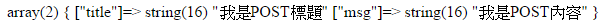

# HTML與PHP之間的傳值(使用form表單)

## form表單傳值有兩種方式 ：
## 分別是 GET 與 POST 兩種
---
# GET
## GET所傳的值會顯示在網址列，適合公開且字數不多的資料，因網址有字數上限，使用GET傳值如以下。

## 而網址列的title就是參數1，msg就是參數2
## 而我是GET標題是值1
## 我是GET到的內容則是值2
## 我們可以利用var_dump函數來查看變數的結構，
## 假設我們輸入 `var_dump($_GET);`
## 瀏覽器上則會顯示
## 在此我們只要透過 `$_GET['參數']`就可以把他所對應到的值取出來。
## example
```php
    echo $_GET['title'];
    // 輸出 我是GET標題
```
---
# POST
## POST所傳的值不會顯示在網址列，適合比較隱密的資料和大量的資料，POST所存的值不限制數量及字數，例如我們可以用在帳號密碼登入，之類這種比較隱私的資料或是留言板這種大量的資料。
## 假設我們var_dump一下POST

## 使用方法與GET一樣是$_，只是將GET換成POST
## 假設我們輸入`$_POST['title']`就會輸出"我是POST標題"
---
# 程式碼部分
## HTML
```HTML
    <center>
        <div style="float:left;width:48%;border:5px solid #000;">
            <h1>POST傳值</h1>
            <!--
            form部分
            action=>表單送出時，資料要送到的位置
            method=>方法，GET或POST
            -->
            <form action="main.php" method="post">
            <!--input部分
                type=型態，text是文字方塊
                name=名字，給PHP處理用，EX:$_POST['name']
                placeholder=浮水印
            -->
                <p><input type="text" name="title" placeholder="請輸入標題"></p>
                <p><textarea name="msg" placeholder="請輸入內容"></textarea></p>
                <p><button type="submit">POST送出</button></p>
            </form>
        </div>
        <div style="float:right;width:48%;border:5px solid #000;">
            <h1>GET傳值</h1>
            <form action="main.php" method="GET">
                <p><input type="text" name="title" placeholder="請輸入標題"></p>
                <p><textarea name="msg" placeholder="請輸入內容"></textarea></p>
                <p><button type="submit">GET送出</button></p>
            </form>
        </div>
    </center>
```

## PHP

```PHP
<?php
if(!empty($_POST)){ //如果$_POST不是空的
    var_dump($_POST);
    echo "<br>";
    echo "POST收到的資料為："."<br>";
    echo "標題：".$_POST['title']."<br>";
    echo "內容：".$_POST['msg'];
}elseif(!empty($_GET)){
    var_dump($_GET);
    echo "<br>";
    echo "GET收到的資料為："."<br>";
    echo "標題：".$_GET['title']."<br>";
    echo "內容：".$_GET['msg'];
}
?>
```
