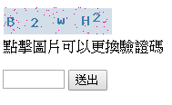

# PHP 圖形驗證碼
## 執行結果


---
# 程式碼的部分(詳細註解)
## HTML
```html
<form method="post" action="#">
    <p>
        
        <br> 點擊圖片可以更換驗證碼
    </p>
    <input type="text" name="checkword" required size="5" maxlength="5">
    <input type="submit" name="Submit" value="送出">
</form>
```

## Javascript(使用jQuery，必須先引入jQuery)
```javascript
$(function () {
    //當圖片被點下，更換圖片
    $("#captchaImage").click(function () {
        $(this).attr('src', "captcha.php");
    });
    //當表單送出，以ajax檢查驗證碼是否正確
    $('form').submit(function () {
        $.ajax({
            url: 'checkcode.php',
            method: 'post',
            data: {
                code: $("[name=checkword]").val()
            },
            success: function (result) {
                alert(result);
            },
            error: function (err) {
                console.log(err);
            }
        });
        //每驗證一次都更換
        $('#captchaImage').attr('src', "captcha.php");
        return false;
    });
});
```

## 產生驗證碼的部分(PHP)
```php
<?php
    //如果沒打開SESSION，就啟用SESSION
    if(!isset($_SESSION)){ session_start(); }
    //一開始先設為空
    $_SESSION['validation_code'] = '';
    //輸出為png檔案
    header("Content-type: image/PNG");
    //在$arr中push $a與$b之間的所有字元 (ASCII)
    function array_push_between_chr(&$arr,$a,$b){
        for($i=ord($a);$i<=ord($b);$i++){
            array_push($arr,chr($i));
        }
    }
    //要放在圖片中的字元陣列
    $imageString = [];
    //取得0~9之間的所有字元
    array_push_between_chr($imageString,0,9);
    array_push_between_chr($imageString,'a','z');
    array_push_between_chr($imageString,'A','Z');
    //圖片寬高與驗證碼字元數量設定
    $width = 120;
    $height =30;
    $size = 5;
    //建立一張圖，填入寬高
    $image = imagecreate($width,$height);
    //分配顏色，第一個參數為圖片，後面為RGB
    $text_color = imagecolorallocate($image,mt_rand(0,200),mt_rand(0,200),mt_rand(0,200));
    $pixel_color = imagecolorallocate($image,mt_rand(0,255),mt_rand(0,255),mt_rand(0,255));
    $border_color = imagecolorallocate($image,255,255,255);
    $background_color = imagecolorallocate($image,211,222,233);
    //產生一個填滿的矩形，參數為圖片,x1,y1,x2,y2,顏色
    imagefilledrectangle($image,0,0,$width,$height,$background_color);
    //產生一個非填滿的矩形(這裡用來做邊框)，參數如上
    imagerectangle($image,0,0,$width,$height,$border_color);
    //產生80(可自訂)個像素(點)，參數為圖片,x,y,顏色
    for($i=1;$i<=80;$i++){
        imagesetpixel($image,mt_rand(0,$width),mt_rand(0,$height),$pixel_color);
    }
    //一開始先將文字產生的x位置大概亂數取3~8(可自訂)
    $x = rand(3,8);
    //驗證碼文字先為空
    $code = '';
    for($i=1;$i<=$size;$i++){
        //在字元陣列中亂數取一個字元
        $current_code = $imageString[mt_rand(0,count($imageString)-1)];
        $code .= $current_code;
        $y = mt_rand(3,10);
        //繪製文字，參數為圖片,字體(預設有1~5),x,y,字元,顏色
        imagestring($image,5,$x,$y,$current_code,$text_color);
        //文字向右偏移
        $x += mt_rand(10,30);
    }
    //輸出png
    imagepng($image);
    //釋放圖片資源
    imagedestroy($image);
    $_SESSION['validation_code'] = $code;
?>
```

## 驗證是否正確(PHP)
```php
<?php
    if(!isset($_SESSION)){ session_start(); }
    $ans_code = $_SESSION['validation_code'];
    $user_code = $_POST['code'];
    //三元運算子
    echo ($user_code == $ans_code)?'驗證成功!':'驗證失敗!';
?>
```