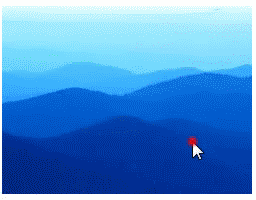
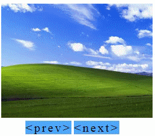

# jQuery Plugin - 相片輪播

## 使用`jQuery Cycle Plugin`
### 可以在 http://jquery.malsup.com/cycle/ 下載
<hr>

# 基本使用方式
## 執行結果：


先把下載完的js載入，必須放在jQuery之後，範例：
```javascript
<script src="https://ajax.googleapis.com/ajax/libs/jquery/3.3.1/jquery.min.js"></script>
<script src="下載下來的路徑"></script>
```

在HTML中插入圖片的部分
```html
<div id="img_cycle">
    
    
    
    
    
</div>
```
接著就是jQuery的部分，如下範例:
```javascript
$(function () {
    $("#img_cycle").cycle();
});
```
## 這樣就完成最基本的相片輪播了
<hr>

# 更進階一點的應用
### 在cycle()當中是可以代參數的，舉例來說：
```javascript
$(function () {
    $("#img_cycle").cycle({
        fx: ('toss'), //輪播類型
        pause: 1, //碰到滑鼠停止輪播
        random: 1 //亂數輪播
        // 1 = True ,2 = False
    });
});
```
## 執行結果：

<hr>

## 也可以透過點擊事件觸發
## 執行結果：


```javascript
$('#img_cycle').cycle({ 
    fx:     'slideY', 
    speed:  300, 
    next:   '#img_cycle', 
    timeout: 0 
});
```
### 而`next`後面放的選擇器#img_cycle就是當這個元素被點下的時候，就會換到下一張圖片。
### 有換下一張的當然也會有換回上一張的，是使用`prev`這個屬性
<hr>

# 比較綜合一點的應用
## 執行結果:


當點下prev時切回上一張圖片，而點下next則是換到下一張。
但這些都只是這個外掛中一部分的功能，詳細可以參閱以下網址:

fx屬性可參考：http://jquery.malsup.com/cycle/browser.html

cycle參數可參考：http://jquery.malsup.com/cycle/options.html