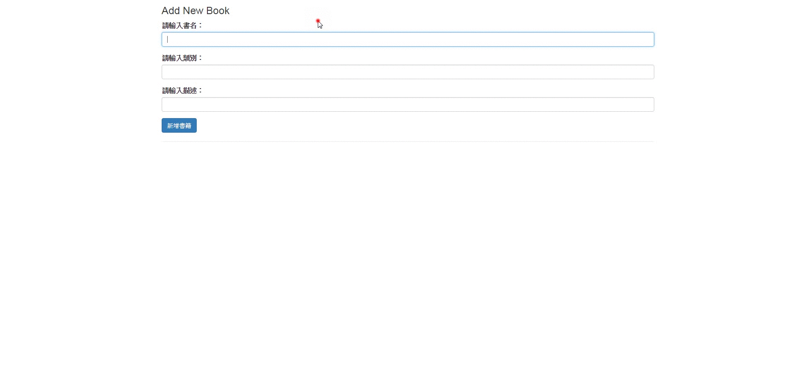

# jQuery 新增及讀取MongoDB(mLab)，使用API
## 執行結果：

## 首先引入了三個東西
```html
<link rel="stylesheet" href="https://maxcdn.bootstrapcdn.com/bootstrap/3.3.7/css/bootstrap.min.css">
<script src="https://ajax.googleapis.com/ajax/libs/jquery/3.3.1/jquery.min.js"></script>
<script src="main.js"></script>
```
### 分別是bootstrap與jquery，並且還有自己寫的main.js，共三個檔案。

## 做一些美工(讓畫面呈現置中)
```css
body {
    margin-left: auto;
    margin-right: auto;
    width: 60%;
    font-size: 16px;
}
```

## HTML部分
```html
<body onload="getBooksRecord()">
    <div id="container">
        <h3>Add New Book</h3>
        <form id="addBookForm">
            <div class="form-group">
                <label>請輸入書名：</label>
                <input type="text" class="form-control" id="bookTitle">
            </div>
            <div class="form-group">
                <label>請輸入類別：</label>
                <input type="text" class="form-control" id="bookCategory">
            </div>
            <div class="form-group">
                <label>請輸入描述：</label>
                <input type="text" class="form-control" id="bookDescription">
            </div>
            <input type="submit" name="submit" value="新增書籍" class="btn btn-primary">
        </form>
        <hr>
        <div class="row">
            <div id="books"></div>
        </div>
    </div>
</body>
```

## javascript的部分
```javascript
$(function () {
    $("#addBookForm").on('submit', function (e) {
        e.preventDefault();
        var title = $("#bookTitle").val();
        var category = $("#bookCategory").val();
        var description = $("#bookDescription").val();
        $.ajax({
            url: "https://api.mlab.com/api/1/databases/資料表名稱/collections/集合名稱?apiKey=自己的APIkey",
            data: JSON.stringify({
                "title": title,
                "category": category,
                "description": description
            }),
            type: "POST",
            contentType: "application/json",
            success: function (data) {
                location.reload();
            },
            error: function (xhr, status, err) {
                console.log(err);
            }
        });
    });
});

function getBooksRecord() {
    $.ajax({
        url: "https://api.mlab.com/api/1/databases/資料表名稱/collections/集合名稱?apiKey=自己的APIkey"
    }).done(function (data) {
        var output = "<div>";
        $.each(data, function (key, data) {
            output += '<div class="well">';
            output += '<h3>' + data.title + '</h3>';
            output += '<p>' + data.category + '</p>';
            output += '<p>描述：' + data.description + '</p>';
            output += '</div>';
        });
        $("#books").html(output);
    });
}
```

## API的部分可以查看mLab的文件，網址:http://docs.mlab.com/data-api/
# API的key在哪裡?
### 點進去自己的帳戶就會看到了，可以重新產生，且必須將Data API accessg設定為Enabled才可以使用這個方式存取mLab。