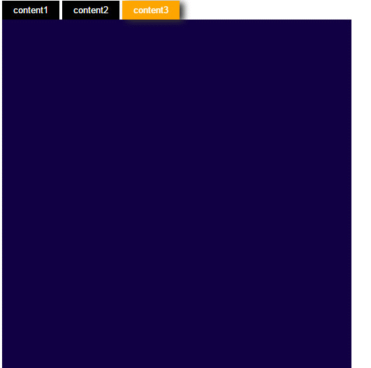

# jQuery=>輪播頁籤

## 繼上次 [jQuery頁籤](https://github.com/xyz607xx/WebPage_Subject/blob/master/jQuery-%E9%A0%81%E7%B1%A4.md)之後，這次增加了輪播的功能。

## 執行結果：



## javascript

```js
<script>
    //先設定變數 page存取目前為第幾頁
    var page=1;
    //設lock變數存取頁籤是否有被點擊過
    var lock=false;
    //自訂函式(方法)，用來自動切換頁籤
    function tab(){
        //如果沒有被點擊過
        if(lock==false){
            //先將page加1
            page+=1;
            //如果page大於3(頁籤上限)就把page設為1，否則page=page(等於不變)
            (page>3)?page=1:page=page;
            $(".background").removeClass("background_hover"); 
            $("button[page="+page+"]").addClass("background_hover"); 
            $("#content div").attr("display",true); 
            $(".con"+page+">div").removeAttr("display",false);
            //否則如果頁籤已經被手動點擊過
        }else if (lock==true)
            //將lock設成false
            lock=false;
        //不管有沒有被點擊過(這個地方已經脫離if)，都重新再呼叫自己一次
        setTimeout("tab()", 1333 );
    }
    $(function(){
        $(".background").click(function(){
            lock=true;
            $(".background").removeClass("background_hover"); 
            $(this).addClass("background_hover"); 
            $("#content div").attr("display",true); 
            $(".con"+$(this).attr("page")+">div").removeAttr("display",false);
            //設page變數為數值型態的這個page
            page=parseInt($(this).attr("page"));
        });
    });
    //間隔2000毫秒(2秒)在呼叫tab函式，只會執行一次，所以在tab中再次呼叫自己
    setTimeout("tab()", 2000 );
</script>
```