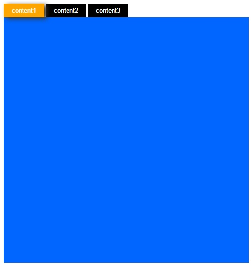

# jQuery=>頁籤

## 執行結果



## javascript

```js
    <script>
        //與$(document).ready()一樣，在DOM後執行的方法
        $(function(){
            //當類別background被點選執行的function
            $(".background").click(function(){      
                //先將所有類別是background的元素選起來，刪除掉background_hover的類別
                $(".background").removeClass("background_hover");   
                //然後將被點選的元素加上background_hover
                $(this).addClass("background_hover");   
                //選取id為content中的所有div，並加入display使其隱藏
                $("#content div").attr("display",true);     
                //將類別為con+(這個的page值)+>div的元素選起來刪除掉display
                $(".con"+$(this).attr("page")+">div").removeAttr("display",false);  
            });
        });
    </script>
```
## HTML
```html
    <div>
        <!--預設被選到的，所以加上background_hover類別(假設為標籤一)-->
        <span>
            <button class="background background_hover" page="1">content1</button>
        </span> 
        <!--page為自訂參數，給jQ取值 (假設為標籤二)-->
        <span>
            <button class="background" page="2">content2</button>
        </span>  
        <!--(假設為標籤三)-->
        <span>
            <button class="background" page="3">content3</button>
        </span>  
    </div>
    <div id="content">  <!--div ID為content-->
        <!--style為背景#0066FF色，寬高500px (假設為內容一)-->
        <span class="con1">
            <div style="background:#06f;width:500px;height:500px;"></div>
        </span> 
        <!--預設為隱藏(不顯示) (假設為內容二)-->
        <span class="con2">
            <div display style="background:#90f;width:500px;height:500px;"></div>
        </span> 
        <!--(假設為內容三)-->
        <span class="con3">
            <div display style="background:#104;width:500px;height:500px;"></div>
        </span> 
    </div>
```

## CSS

```css
        .background{    /*類別為background*/
            border: none;   /*沒邊框*/
            padding: 6px 16px;  /*上下留白6px，左右留白16px*/
            text-decoration: none!important;    /*超連結無底線*/
            color: #fff;    /*文字顏色白色*/
            background-color: #000;     /*背景顏色黑色*/
            text-align: center;     /*文字對齊置中*/
            cursor: pointer;    /*游標樣式改成碰觸到連結的樣式*/
        }
        .background_hover{  /*類別名稱為background_hover*/
            filter:drop-shadow(6px 3px 5px #333);   /*濾鏡:陰影,顏色為#333333*/
            background-color:orange;    /*背景顏色為橘色*/
        }
        div[display]{   /*選取div中有display的所有元件(Element)*/
            display:none;   /*消失*/
        }
```