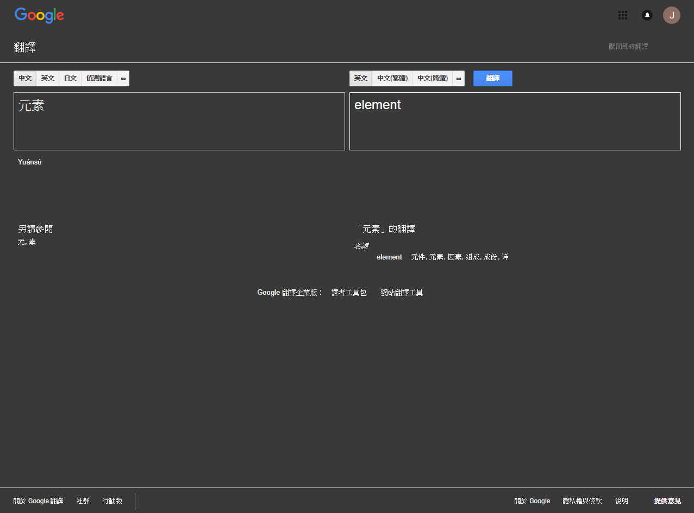

# javascript-更改google翻譯的背景顏色

## 執行結果


## 以下程式碼可以直接在console視窗執行。

```javascript
//設定背景顏色的色碼
const colorCode = "#393939";
//選取所有元素
var elementList = document.querySelectorAll("*");
//設定例外ID的陣列
var exceptionIdArray = ["gt-submit"];
//設定要刪除的元素的ID (主要只是為了美觀，不刪除也無妨)
var deleteArray = ["gt-pb-sw1", "gt-res-tools", "gt-src-tools", "gt-swap"];
//刪除的動作
deleteArray.forEach(function (x) {
    var d = document.getElementById(x);
    d.remove(d.selectIndex);
})
//先將最上方標題列背景調暗
document.getElementsByClassName("gb_Ef gb_Dg")[0].style.background = colorCode;
//開始將全部背景調暗
for (var i = 0; i <= elementList.length; i++) {
    //如果元素i不存在於標題列且例外陣列中也不存在元素i，並且元素i的user-select的CSS為空或元素i的標籤等於span執行
    if (!isSame(elementList[i]) && !exceptionIdArray.some(function (x) {
            return x == elementList[i].id;
        }) && (elementList[i].style.userSelect == "" || elementList[i].tagName == "SPAN")) {
        elementList[i].style.background = colorCode;
        elementList[i].style.color = "#fff";
    }
}
//判斷是否相同
function isSame(node) {
    var d = document.querySelectorAll("#gb *");
    for (var i = 0; i < d.length; i++) {
        if (d[i] == node) {
            return true;
        }
    }
    return false;
}
```