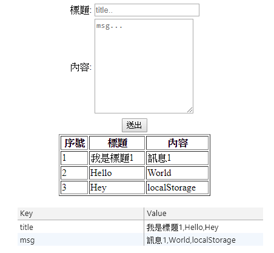

# LocalStorage
## 簡介
* ### localStorage 是比Cookie更好的儲存方案
* ### localStorage 儲存在client端資料，沒有時間限制
## 使用前要做的事
### 使用前檢查瀏覽器是否支援
## 如何檢查?
### 很簡單
```javascript
if (typeof(Storage) !== "undefined") {
    // 你的瀏覽器有提供storage support
    // Some code.....
} else {
    // 沒有支援storage
}
```
## 如何使用?
## localStorage.key = value
* ## key: 是你想要儲存的資料名稱，例如name
* ## value：是你想要儲存的資料，例如 "tom";
* ## 例如:`localStorage.name="tom"`;
## 也可以使用 `localStorage.setItem(key, name)`來儲存資料
## `localStorage[key]`或`localStorage.getItem(key)`來取得資料
## 例如: `localStorage['name']`
## * 取出來的值都是字串，若要計算，記得parseInt轉型

## 如何刪除?
## `localStorage.removeItem(key)`
## 例如 `localStorage.removeItem('name')`

## 而localStorage可以在 開發人員工具(chrome為F12)的Application中的Storage找到。

# 練習
## 用localStorage做一個簡易的留言板(僅練習用)
* ### 一個文字方塊(`input`)
* ### 一個文字區域(`textarea`)
* ### 一個按鈕(`button`)
* ### 最後留言內容產生在DIV中。

# 範例
### (就不做美工了)
## 結果

## 表格下方是localStorage的對照
# Code
## JavaScript
```javascript
    // 加入項目的function
    function addItem() {
        // 設定變數為form中元素的值
        var title = form.title.value;
        var msg = form.msg.value;
        // 如果還沒有留言過，是未定義的，就直接設定
        if (localStorage['title'] == undefined) {
            // 在localStorage設定一個title和msg
            localStorage.title = title;
            localStorage.msg = msg;
        } else {
            // 否則設成原本的加上 , 後 加上新的
            localStorage.title = localStorage['title'] + "," + title;
            localStorage.msg = localStorage['msg'] + "," + msg;
        }
        // 把表單的元素值設成空
        form.title.value = "";
        form.msg.value = "";
        alert("傳送成功!");
        // 顯示留言內容
        view();
    }
    // 顯示留言內容的function
    function view() {
        // 設定變數存localStorage以逗號字串分割後的結果(為陣列)
        var title = localStorage['title'].split(",");
        var msg = localStorage['msg'].split(",");
        // 用ID取得輸出的位置(DIV)
        var contentDiv = document.getElementById("content");
        // 設一個變數存要加入的內容
        var content = ""
        content = "<table border=1 width=250px>";
        content += "<th>序號</th>";
        content += "<th>標題</th>";
        content += "<th>內容</th>";
        // 陣列從0開始
        for (var i = 0; i < msg.length; i++) {
            content += "<tr>";
            // parseInt為轉數字型態，避免1+1=11
            content += "<td>" + (parseInt(i) + 1) + "</td>";
            content += "<td>" + title[i] + "</td>";
            content += "<td>" + msg[i] + "</td>";
            content += "</tr>";
        }
        content += "</table>";
        // 加入HTML
        contentDiv.innerHTML = content;
    }
```
## HTML (body部分)
```html
<!--頁面讀取完就顯示留言內容-->
<body onload="view()">
    <center>
        <div>
            <form id="form" method="dialog">
                <table>
                    <tr>
                        <td>標題:</td>
                        <td><input type="text" name="title" placeholder="title.."></td>
                    </tr>
                    <tr>
                        <td>內容:</td>
                        <td><textarea rows="10" name="msg" cols="20" placeholder="msg..."></textarea></td>
                    </tr>
                    <tr>
                        <td colspan="2" style="text-align:center;">
                            <!--點下去加入項目-->
                            <button onclick="addItem();">送出</button>
                        </td>
                    </tr>
                </table>
            </form>
        </div>
        <!--要輸出內容的DIV-->
        <div id="content">

        </div>
    </center>
</body>
```